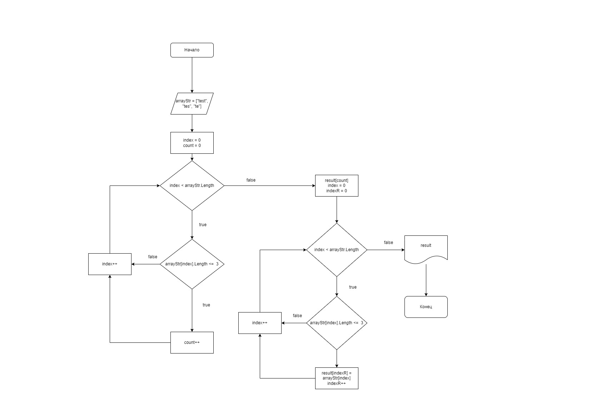

# Итоговая контрольная работа

## Задача

Написать программу, которая из имеющегося массива строк формирует массив из строк, длина которых меньше либо равна 3 символа. Первоначальный массив можно ввести с клавиатуры, либо задать на старте выполнения алгоритма. При решении не рекомендуется пользоваться коллекциями, лучше обойтись исключительно массивами.

## Запуск программы

1. Скачайте репозиторий на свой компьютер.
2. Откройте командную строку в корне репозитория.
3. Перейдите в папку "program".
4. Запустите программу командой `dotnet run`.

## Диаграмма алгоритма

